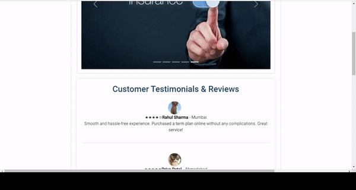
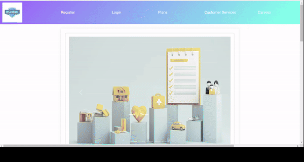
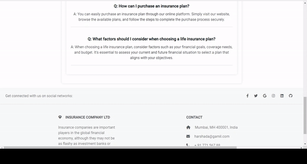

# Insurance-Management-Platform
This  project centers on the development of a user-friendly web-based insurance management platform. This platform will efficiently serve administrators, employees, customers, and agents, streamlining their insurance-related tasks and interactions


## What One can learn From this Project

#### Platform Development


Developed a user-friendly web-based insurance management platform 

#### User Authentication


Implemented robust role-based user authentication methods for data privacy and system security 

#### Data Management


Executed comprehensive data management capabilities, optimizing the handling of customer, agent, and policy records 

#### Configurable Settings


Integrated customizable configurations for diverse insurance categories, plans, schemes, and commission structures,olicy registration, commission calculation, withdrawal processing, and dynamic report generation. 

#### Data Security and Compliance


Prioritized data security and ensured compliance with data validation and middlewares

#### Entity Relationship Management


 managing entity relationships within the database

#### API Integration Proficiency


integrating external APIs, enabling seamless data exchange with external systems


#### Rest API Creation and Connection


creating and establishing connections between RESTful APIs, facilitating seamless data sharing and system functionality 

## Dashboard Previews

#### Administrator Dashboard



#### Employee Dashboard



#### Customer Dashboard



#### Agent Dashboard


## Run Locally

This project requires the following setup to run locally:

#### Backend (Insurance Backend)

1. Have Visual Studio 2022 or later installed on your machine.
2. Set up Microsoft SQL Server.
3. Postman (optional).
4. Clone this repository and open the Insurance Backend solution in your Visual Studio.

#### SQL Server Configuration

1. Open SQL Server Management Studio (SSMS).
2. Add a new SQL Server and connect to your local server (e.g., LAPTOP-PCU5FAND\SQLEXPRESS).
3. Go to the properties of the SQL Server, find the connection string, and copy its value.
4. Paste the connection string value into the `appsettings.json` file (located in the solution explorer).

#### Database Migration

1. Open the NuGet Package Manager Console.
2. Type the following commands:
   ```powershell
   Add-Migration <MigrationName>
   Update-Database
This will create a Migrations folder in the solution explorer.

#### Run the Backend

1. Run the project in Visual Studio; it will open a Swagger interface in the default browser.
2. You can interact with endpoints in Swagger to add, fetch, and modify data.


#### Angular Project Configuration

1. Install TypeScript.
2. Install Angular.
3. Create your Angular project in vs code using the command in the terminal :
   ```bash
   ng new <project-name>
   ng serve
#### Frontend (Insurance Frontend)

1. Navigate to the `insurance_frontend` folder.
2. Copy the `src` folder.
3. Paste the `src` folder into your Angular project, replacing the existing one.
## Additional Resources

### Learning Angular

- [Angular Official Documentation](https://angular.io/docs)
- [Angular Tutorial - W3Schools](https://www.w3schools.com/angular/)
- [Angular - Codecademy](https://www.codecademy.com/learn/learn-angularjs)

### Learning .NET

- [.NET Documentation](https://docs.microsoft.com/en-us/dotnet/)
- [.NET Core Guide](https://docs.microsoft.com/en-us/dotnet/core/)
- [Learn .NET - Microsoft Learn](https://learn.microsoft.com/en-us/dotnet/)

### Learning MS SQL Server

- [SQL Server Documentation](https://docs.microsoft.com/en-us/sql/)
- [SQL Server Tutorial - W3Schools](https://www.w3schools.com/sql/)


### Development Tools

- [Visual Studio Code](https://code.visualstudio.com/)
- [Visual Studio](https://visualstudio.microsoft.com/)

## Contributing

Thank you for considering contributing to the Insurance Management Platform! Your help is greatly appreciated.

### How Can You Contribute?

1. **Reporting Bugs**: If you encounter any bugs or unexpected behavior, please [open an issue](https://github.com/abhilaaash/Insurance-Management-Platform/issues) and provide detailed information about the problem.

2. **Suggesting Enhancements**: Have an idea to improve the project? [Create an issue](https://github.com/abhilaaash/Insurance-Management-Platform/issues) and let us know about it.

3. **Code Contributions**: If you want to contribute to the codebase, follow these steps:
   - Fork the repository.
   - Create a new branch for your feature or bug fix.
   - Make changes and test thoroughly.
   - Submit a pull request with a clear description of your changes.

4. **Questions and Discussions**: If you have questions or want to discuss something related to the project, feel free to [start a discussion](https://github.com/abhilaaash/Insurance-Management-Platform/discussions).

### Getting Started

1. Clone the repository: `git clone https://github.com/abhilaaash/Insurance-Management-Platform.git`
2. Install dependencies for both backend and frontend.
3. Follow the project setup instructions provided in the README.

### Code of Conduct

Please note that this project follows the [Contributor Covenant Code of Conduct](CODE_OF_CONDUCT.md). By participating, you are expected to uphold this code.

### License

This project is licensed under the [MIT License](LICENSE). By contributing, you agree that your contributions will be licensed under this license.

Let's make this project better together!

